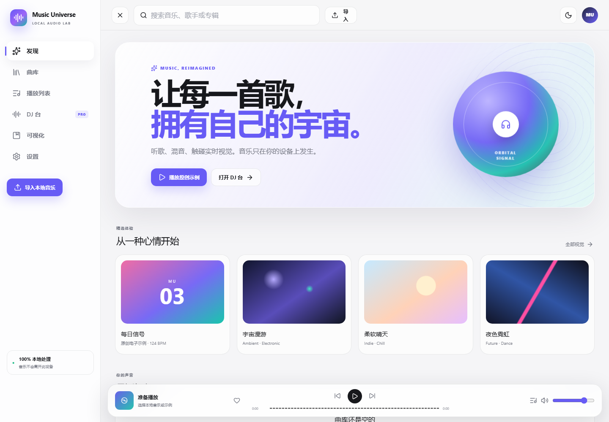

# Music Universe

> 留一点空间，给音乐。清新的本地播放器、深色双 Deck 工作台和音乐时钟驱动的音游。

**中文** | [English](README.en.md)

[](https://github.com/Aaron0837/music-universe/actions/workflows/ci.yml)
[](https://github.com/Aaron0837/music-universe/actions/workflows/deploy.yml)
[](LICENSE)

React + TypeScript + Web Audio API + Canvas / Three.js + Zustand + Dexie。

**音乐与分析结果仅存本机** —— 不上传、不接入遥测、没有账号、没有服务端。整个应用是一个可离线安装的静态站点。

[线上版本](https://aaron0837.github.io/music-universe/) 随 main 分支由 CI 自动构建部署，也可用 `workflow_dispatch` 手动触发。

## 预览

| 首页 | DJ 台 | 移动端 |
|:---:|:---:|:---:|
|  |  |  |

截图来自 `scripts/capture-preview.mjs`，曲目为脚本生成的测试音频，不是用户曲库。

## 本地运行

```bash
npm install
npm run dev
```

Windows 若阻止 PowerShell 脚本，使用 `npm.cmd`。点击"播放原创示例"启用声音；可将本地音乐拖入页面或通过文件选择器导入。

```bash
npm test          # Vitest 单元测试
npm run test:e2e  # Playwright，Chromium / Firefox / WebKit
npm run build     # tsc -b && vite build
npm run preview
node scripts/verify-production.mjs
```

多引擎套件需先 `npx playwright install firefox webkit`。注意 Playwright 的 Windows WebKit 不含 Web Audio，故 WebKit 只跑外壳、离线与降级用例。

## 功能特性

**播放与曲库**

- 播放模式：循环顺序 / 列表循环 / 单曲循环 / 随机播放（快捷键 `M`）。随机不是"每首随机抽"，而是把队列洗成一个排列，**走完一轮才会重新洗牌**，所以每首都会播到、不会重复；没有队列时（从曲库直接播一首）单曲循环依然生效。
- 喜欢与最近播放：曲库每行有心形按钮，还能"只看喜欢"。左侧另有 **我的音乐** 页集中展示两者。最近播放按真实播放记录排序，**重听会提到最前而不是新增一条**；删掉曲目时两处会自动清理。
- 睡眠定时：15 / 30 / 45 / 60 分钟，到点自动暂停两个 Deck，卡片上带倒计时。
- 播放列表：可加入 / 移除曲目、上移下移排序、重命名与删除歌单；按顺序连放，一首自然播完自动接下一首（暂停、跳转、循环不会触发续播）。
- 底部控制跟随当前 Deck。

**播放体验**

- **沉浸式播放大屏**：点底部播放器封面或按 `V` 打开全屏播放面（`Esc` 关闭）。封面模糊成背景光，大封面随播放缓慢旋转（关掉减少动态效果即静止）。**逐行歌词**跟随播放位置居中滚动，当前行有卡拉 OK 扫光；点任意一句即可跳到该时间点。没有歌词时可直接粘贴 LRC 或纯文本保存，编辑与清除都在同一处，示例曲目不可保存。
- **封面取色主题**：正在播放的封面决定全局 `--accent` / `--accent-2`，并额外给出 `--glow` / `--tint` 供背景光晕与底纹使用。切换明暗主题会**重算**配色，而不是沿用为另一种背景选的颜色。
- 歌词来自文件内嵌（ID3v2 USLT / SYLT、Vorbis `LYRICS`、MP4 `©lyr`），**不联网抓取**。

**DJ 台**

- 独立 Deck 波形和拍线、四个 Hot Cue、1/2/4/8 拍量化循环、倒放、EQ、滤波与效果器发送量。首次点击 Cue 设点，再次跳转，Shift+点击清除。归零效果器发送量即关闭该效果。
- **保调变速（Key Lock）**：开启后 BPM 只改变速度，不再带动音高；Harmony 变成纯调性移调。基于 SoundTouch 的 AudioWorklet（MPL-2.0）实时处理，实测 1.5x 变速与 0.75x 都保持 440 Hz，升八度准确落在 880 Hz。
- Worker 分析 BPM、首拍与置信度，结果缓存；可手动修正原曲 BPM、Tap Tempo、当前位置设为首拍。Sync 在置信度足够时匹配速度与拍点。
- 大型 BPM / 音量旋钮：上下拖动，Shift 精调，也支持键盘方向键和数字输入。
- **Beat Garden**：BPM Match（A 轨整拍）、Drum Grid（八步鼓机）、Harmony（同时双轨）。以 Deck A 的音乐位置驱动，暂停冻结、变速跟随、跳转重建。
- Perfect ±80 ms / Great ±150 ms；重复击键不重复得分、漏击断连。Perfect 使用独立受限底鼓输出，Harmony 附加合成和弦；不修改原曲。
- 音游放大、Esc 退出、焦点约束；`F` 只击打第四轨，全屏有独立按钮。390px 下使用 Deck A / 音游 / Mixer / Deck B 分页。

**可视化**

- 三维视觉走真实 HDR 后处理管线：`EffectComposer` + `UnrealBloomPass` 泛光 + ACES 色调映射，再加一道色差 / 暗角 / 颗粒的调色 pass，而不是靠加色混合硬凑辉光。泛光强度跟随响度与拍点呼吸。
- 五个原创预设：Nebula、Gravity、Bloom、**Hyper Tunnel**（顶点着色器生成星流，逐帧只更新 uniform）与 **Aurora Veil**（片元着色器程序化极光）。预设统一在 `src/presets/index.ts` 注册一次。
- 低质量档位直接跳过整条后处理管线，保留原先的裸渲染路径兜底。
- 首页原创 CSS 唱片花园、封面集合、导入和播放入口。背景柔光与最多 64 个 Canvas 粒子共用一个动画循环；低性能降至 32 个，离开后静止、页面隐藏时停止。

**平台**

- **可安装的 PWA**：自带 manifest、192 / 512 图标与 maskable 图标；Service Worker 预缓存应用外壳，断网也能冷启动。
- 暖白 / 鼠尾草绿 / 浅蓝主题，统一发现、曲库、列表、设置和底部播放器；保留深色及实时跟随系统。
- 触屏静态柔光；系统减少动态效果优先，设置中的效果开关、低动态和延迟补偿持久保存。DJ 区不启用背景跟随。

## 使用边界

- 保调变速依赖 AudioWorklet：不支持的浏览器会自动禁用该开关（并在 Deck 上说明原因），其余功能不受影响。
- BPM 是基于起音包络的近似分析，可能存在倍速 / 半速歧义。弱节奏、变拍、节奏漂移的音乐需要手动校准。当前分析取前 120 秒和第一声道；固定网格不跟踪变速曲。
- 倒放时不进行 Sync 或音游。跳转和循环回绕会重建附近音符；短循环不适合完整音游练习。游戏是程序化节奏练习，不是自动转录原曲鼓谱。
- 转盘提供拖动定位式搓动，不宣称 AudioWorklet 级专业 scratch。当前效果器为独立湿声发送，不是独立干湿交叉混合。
- MP3 / WAV / FLAC / M4A / OGG 的具体可解码范围取决于浏览器；暂无额外 WASM 解码器。
- 曲库离线恢复指已经打开或缓存的应用可读取本地文件；Service Worker 已支持应用外壳的冷启动离线，但音频仍须先导入本机。
- 播放列表支持增删与排序，但尚无嵌套歌单、导入导出与云同步。当前不增加 Tauri 或 WASM。
- 播放模式只作用于"队列"（歌单或整张曲库顺序播放）。从曲库直接点单首播放时没有队列，此时只有单曲循环有意义，其余三种等同播完即停。
- 喜欢、最近播放与播放模式存在本地数据库的 `settings` 表（Dexie v3）。保存是**不阻塞播放**的后台写入，所以刚点完喜欢就强制刷新页面，极少数情况下可能抢先于写入；正常使用无影响。
- 歌词来自文件内嵌，**不联网抓取**。没有内嵌歌词时可手动粘贴 LRC；纯文本歌词没有时间轴，不能点击跳转。
- 取色主题读取封面像素。纯灰 / 纯黑白封面没有可用的色相，会回退到界面默认强调色，而不是凭空造一个颜色。`--accent` 与 `--accent-2` 始终经过对比度校正（≥ 4.5:1），`--glow` / `--tint` 只作装饰、不参与文字对比。
- 自动化输出电平检查不能替代真实扬声器试听。跨浏览器测试跑在 Chromium、Firefox 与 WebKit（Safari 引擎）上，但 **Playwright 的 Windows WebKit 不含 Web Audio**，因此 WebKit 只覆盖外壳、离线与降级路径；真实 Safari / iOS / Android 实机仍需人工验收。

## 架构与模块

```text
React pages / components → serializable Zustand snapshots
           ↓ commands
MixerEngine → Deck A / B → Gain / EQ / Filter / FX
           → equal-power crossfader → Master / limiter → output
           ↓ audio frames
Canvas / Three.js       RhythmSession ← TransportClock / BeatGrid
           ↑
LibraryRepository → Dexie v3 ← beat analysis Worker
```

数据流是单向的：UI 只发命令与订阅可序列化的快照。音频帧与指针坐标这类每帧数据**不进 React 状态**，它们走独立的渲染通道。

| 目录 | 职责 |
|---|---|
| `src/app/` `src/pages/` `src/components/` `src/styles/` | 界面、路由与样式分层 |
| `src/hooks/` `src/stores/` `src/state/` | 命令层与状态 |
| `src/audio/` | 音频引擎、拍点分析、保调变速 |
| `src/rendering/` `src/presets/` `src/interaction/` | 三维渲染、可视化预设、指针输入 |
| `src/data/` `src/library/` `src/playlists/` `src/lyrics/` `src/theme/` | 持久化与纯规则 |
| `src/types/` | 类型，按域分文件（`models` 数据 / `visuals` 渲染） |

两处容易误读的地方值得单独点出：`src/audio/audioMath.ts` 与 `src/audio/analysis/` 是**不同层次**——前者是引擎每帧调用的信号数学，后者是后台 Worker 里的拍点分析；`src/state/AppState.ts` 是**故意的**可变单例而非遗留代码，它承载每帧数据让渲染循环绕过 React 重渲染，生命周期长的 UI 状态才放 `src/stores/`。

**设计理由、具体参数值、迁移策略与边界条件都写在 [docs/design/](docs/design/)** —— 建议从[架构](docs/design/architecture.md)开始读。

## 本地视觉审阅

先启动开发服务（4173 端口），再运行：

```bash
npm run dev -- --host 127.0.0.1 --port 4173
# 另一个终端
node scripts/capture-preview.mjs
```

截图与鼠标跟随短录屏生成于 `test-results/review/`（Git 忽略）：首页、曲库、设置、DJ、放大舞台，以及 390 / 768 / 1440 / 1920 宽度。截图曲目为脚本生成的测试音频，不是用户曲库。视频是视觉演示，不含扬声器录音。

验证三维预设真的在出画（而不是挂上一个空白 canvas）：

```bash
node scripts/canvas-proof.mjs
```

它对每个预设单独截图 `.visual-stage canvas`，再在 Chromium 里解码并统计亮度分布；任一预设标准差过低或全黑则脚本以非零码退出。注意不要改用 `drawImage` 直接读在线 canvas——在 `preserveDrawingBuffer: false`（默认）下会假阴性报全黑。

## 测试

Vitest 覆盖播放时钟、速率斜坡、Sync 数学、循环、拍点检测、游戏窗口、保调变速速率解析、播放列表排序、LRC 解析与主句定位、取色与对比度校正、播放模式与洗牌排列、喜欢 / 历史 / 睡眠定时规则及预设资源释放。

Playwright 在 Chromium、Firefox 与 WebKit 三个引擎上覆盖真实示例 / 文件音频输出、离线读取、迁移、Perfect 输出、拖放、触控组合、主题、布局、可视化切换、保调变速基频、播放列表全流程、歌词保存 / 高亮 / 跳转与取色主题、喜欢 / 历史 / 播放模式 / 睡眠定时、PWA 离线冷启动，以及无 AudioWorklet / 无 Web Audio 时的降级路径。仍需人工检查听感和真实设备性能，不能以自动测试通过宣称全平台验收。

`push` 到 main 与所有 PR 都会自动跑单元测试与构建（见 `.github/workflows/`）。

## 贡献

欢迎参与。请先阅读 [CONTRIBUTING.md](CONTRIBUTING.md) 与[贡献者公约](CODE_OF_CONDUCT.md)。

- 发现安全漏洞请走 [私密举报通道](https://github.com/Aaron0837/music-universe/security/advisories/new)，见 [SECURITY.md](SECURITY.md)。
- 改动记录见 [CHANGELOG.md](CHANGELOG.md)。

## 许可

MIT；见 [LICENSE](LICENSE) 与 [CONTRIBUTING.md](CONTRIBUTING.md)。

"Orbital Signal"及 Perfect 音效由本项目代码原创合成，无外部采样；代码内 CSS 插画为原创。不得加入未经授权的音频、封面、字体或纹理。
