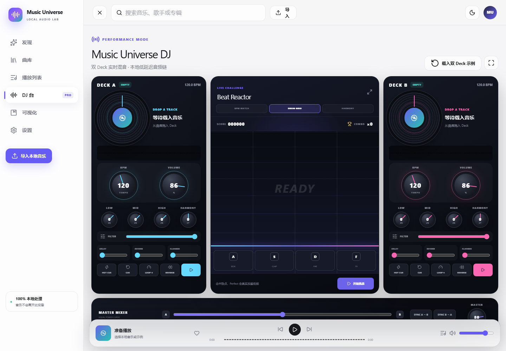

# Music Universe

> 本地音乐播放器、双 Deck DJ 工作台与实时视觉宇宙，全部运行在你的设备上。

Music Universe 使用 React、TypeScript、Web Audio API、Three.js 和 IndexedDB 构建。它既能作为简洁的日常播放器，也能将任意本地歌曲载入 Deck A / B，进行 BPM、音量、EQ、Harmony、效果器、Cue、Loop 与交叉混音操作。

当前线上版本仍位于 **[GitHub Pages](https://aaron0837.github.io/music-universe/)**；新版只有在本地验收并获得明确授权后才会发布。




## 本地运行

```bash
npm install
npm run dev
```

验证生产版本：

```bash
npm test
npm run test:e2e
npm run build
```

Windows 若阻止 `npm.ps1`，使用 `npm.cmd`。

## 架构

```text
React UI + Zustand snapshots
          ↓ commands
MixerEngine ── Deck A / Deck B ── EQ / Filter / FX
          ↓ analysis                    ↓
Canvas / Three.js visualizers    equal-power crossfader
          ↑
LibraryRepository ── Web: Dexie/IndexedDB
                  └─ Desktop: Tauri/SQLite（后续阶段）
```

- `src/audio/engine/`：双 Deck、传输、混音与实时效果。
- `src/data/`：曲库接口和浏览器本地存储实现。
- `src/components/dj/`：转盘、旋钮、推子与音游。
- `src/components/visualizers/`：Canvas 视觉和 Three.js 预设适配。
- `src/stores/`：可序列化 UI 与播放器快照；不保存 AudioNode 或 WebGL 对象。

## 音频与隐私

导入的 MP3、FLAC、WAV、M4A 或 OGG 文件保存在浏览器 IndexedDB 中，不会上传。首次播放必须由用户点击，以满足浏览器 AudioContext 策略。“Orbital Signal”由代码在运行时生成，不包含外部采样，可用于验证真实音频输出。

当前 Harmony 使用 Web Audio `detune` 完成整轨半音调整；高质量 Key Lock、WASM 保调变速和 Tauri Windows 打包属于后续专业 DSP 阶段。

## 新增视觉预设

实现 `UniversePreset`，在 `create` 中分配资源、在 `update` 中复用 TypedArray，并在 `dispose` 中释放所有 Three.js geometry 与 material。预设必须原创或拥有允许再分发的许可证。

项目采用 MIT License。贡献前请阅读 [CONTRIBUTING.md](CONTRIBUTING.md)。
