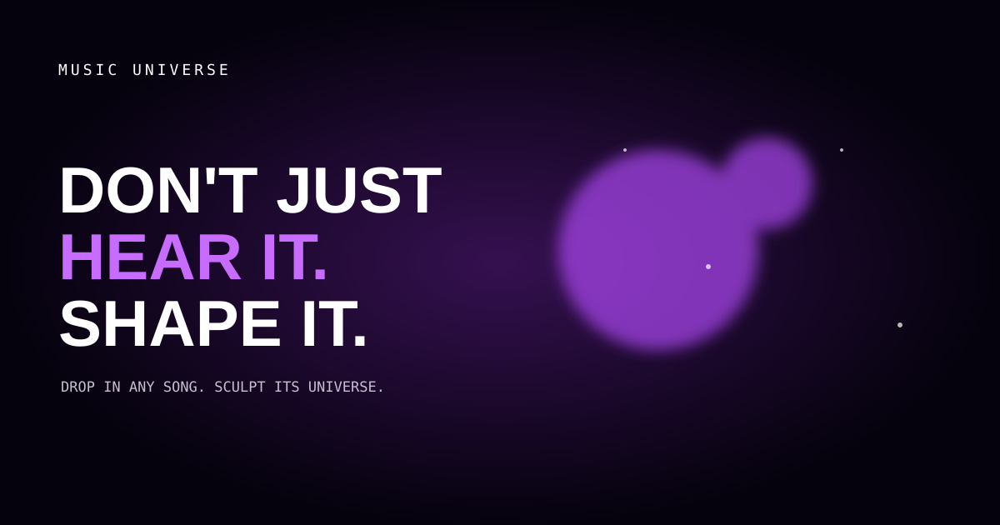

# Music Universe

> Drop in any song. Shape the light. Your audio never leaves the browser.

Music Universe is an original, audio-reactive visual instrument built with Three.js and the Web Audio API. It turns a local track—or the included code-generated demo—into three interactive worlds. Move, press, drag, zoom and touch the canvas to perform the visuals in real time.

**[Launch the live experience](https://aaron0837.github.io/music-universe/)**



## Run it

```bash
npm install
npm run dev
```

Production checks:

```bash
npm test
npm run build
```

The app has no server, account, telemetry, or upload endpoint. Local tracks are read through an object URL and remain on the listener's device.

## Worlds and controls

- **Nebula** — treble illuminates dust, mids move the cloud, bass expands space.
- **Gravity Well** — the pointer bends a particle field and bass adds mass.
- **Cyber Bloom** — taps plant luminous structures that grow with the music.
- Move to steer; hold and drag to charge the field; click/tap to burst; scroll or pinch to zoom.
- `1–3` switches worlds, `Space` plays/pauses, `F` toggles fullscreen, and `H` hides the interface.

## Architecture

```text
HTMLAudio / generated demo → AudioEngine → normalized AudioFrame
                                              ↓
Pointer + touch → InteractionController → UniversePreset → Three.js renderer
                                              ↑
                              AppState + preset controls
```

The renderer reuses typed arrays and GPU resources, caps device pixel ratio, and selects a particle budget for the device. A Canvas 2D spectrum is used if WebGL cannot start. Reduced-motion can follow the operating system or be enabled manually.

## Add a visual preset

1. Create `src/presets/your-world/index.ts` and export a `UniversePreset`.
2. Allocate objects in `create`, mutate them in `update`, and release every geometry/material in `dispose`.
3. Register the preset once in `src/main.ts` and add a focused unit test.

The public contract lives in `src/types.ts`. Audio values are normalized to `0–1`; do not allocate arrays in `update`. Presets must be original or use assets whose license permits redistribution.

## Generated demo and license

“Orbital Signal” is synthesized at runtime by `AudioEngine.playDemo`; it contains no sampled recording. The composition and project source are released under the MIT License. You may reuse the generated demo under CC0-1.0.

## Roadmap

- Preset thumbnails and lazy-loaded community packs
- Offline video capture using browser-native APIs
- Optional microphone input
- Performance HUD and automated GPU benchmarks

Contributions are welcome. Read [CONTRIBUTING.md](CONTRIBUTING.md) before opening a pull request.
